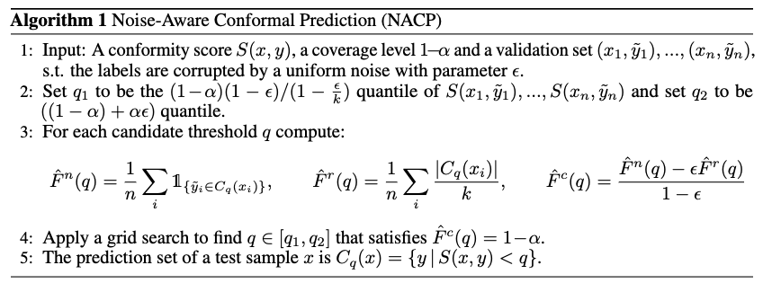
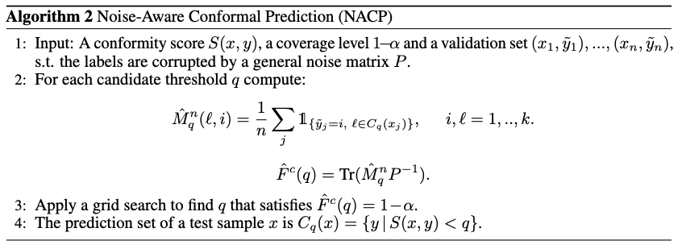

# Noise-Aware-Conformal-Prediction
Code release for "Estimating the Conformal Prediction Threshold from Noisy Labels"

## Algorithm for Uniform noise

## Algorithm for General noise matrix

## Repository Structure
1. `HPS.py`, `APS.py`, `RAPS.py` - original methods for conformal prediction
2. `nacp_HPS.py`, `nacp_APS.py`, `nacp_RAPS.py` - Noise Aware Conformal Prediction Framework applied to known scores.

## Baselines
The baselines we compared ourselves to provide code:
1. Adaptive - [code](https://github.com/msesia/conformal-label-noise)
2. NRCP - [code](https://anonymous.4open.science/r/Noise-Robust-Conformal-Prediction/README.md)
